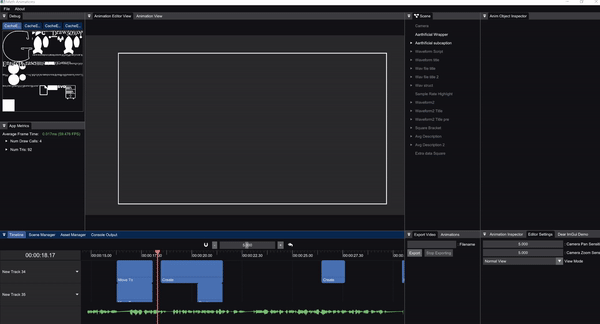

# Math Anim

This is a tool I use to create animations for my videos on my YouTube channel. You can see an example of a video created using this tool [here](https://www.youtube.com/watch?v=iydG-e1dQGA). My goal is to have nearly identical animations to those produced by [Manim](https://www.manim.community), except in realtime with a GUI+audio preview to enhance the editing process.

This is a small GIF showcasing some of the capabilities of this tool:



## Supported Platforms

* Windows

## Compiling on Windows

### Requirements

* CMake 3.16 or later (download [here](https://github.com/Kitware/CMake/releases/download/v3.24.2/cmake-3.24.2-windows-x86_64.msi))
* YASM Assembler version 1.2.0 or later
  * Download the yasm exe from the following [link](http://www.tortall.net/projects/yasm/releases/yasm-1.3.0-win64.exe)
  * Rename yasm-*-win64.exe to yasm.exe
  * Copy yasm.exe into a location that is in the `PATH` environment variable

First clone the repository and the submodules by running:

```batch
git clone --recursive https://github.com/ambrosiogabe/MathAnimation
```

### Compiling

> _NOTE:_ Make sure that you have completed the first time setup instructions if this is your first time compiling this project. Click the dropdown above to get the full instructions.

<br/>

> _NOTE:_ CMake is required to build this. Make sure you have CMake 3.15 or newer installed.

Run the following commands:

```batch
mkdir build 
pushd build 
cmake ..
popd 
```

Then open the project `build/MathAnimationsPrj.sln` or compile it from the command line using the MSVC developer's prompt.

## Current Features

Project Management:

* Create/Open projects using the project splash screen
* Create/Open different scenes inside a project using `Scene Manager` tab.
* Create/Open different scripts using `Asset Manager` tab.

Console Output:

* Any scripts added in the `Asset Manager` will dump any errors here
* Any logs written from a script will end up here
* Click on a log to open the file that logged it

Animation Editor View:

* Use this view to edit scenes as you're working on them
* Gizmos are available in this view to drag objects around
* You can click on objects here to pull up their properties in the inspector
* Mouse scroll wheel to zoom
* Click mouse scroll wheel to pan

Animation View:

* Final rendered view of the current scene
* Press play/stop to start the animation
  * Press space at any time to play/stop the animation as well

Export Video:

* Export the final animation as an mp4 file

Timeline (can be found in the `Timeline` tab):

* Zoom timeline in out using the zoom bar in the top center
* Enable snapping of timeline clips by clicking the magnet icon
  * Red means it's on, white means it's off
* Reset zoom by pressing the `Undo-All` button to the right of the zoom bar
* Create new timeline tracks by right-clicking the left panel
* Add/Remove audio waveform preview by right-clicking the left panel
* Drag/drop animations onto the timeline
* Drag cursor by clicking the ruler and dragging
* Delete clips by selecting and pressing `Delete` on your keyboard
* Resize clips by clicking edge of clips
* Move clips by clicking and dragging the clips

Animations (can be found in the `Animations` tab):

* Move To animation (moves an object to the specified position)
* Create Animation (renders the outline of the object/children and then fills in the shapes)
* Un-Create (Create in reverse)
* Fade In
* Fade Out
* Replacement Transform (morphs one object/children into another object/children)
* Rotate To (NOT IMPLEMENTED)
* Animate Stroke Color (NOT IMPLEMENTED)
* Animate Fill Color (NOT IMPLEMENTED)
* Animate Stroke Width (NOT IMPLEMENTED)
* Shift (BROKEN)
* Circumscribe (plays an animation where a line surrounds the object/children then disappears)
* Animate Scale

Scene Tab:

* Object is green if it's animating, gray if it's inactive, and white if it's active
* Right-Click to add animation object
* Select object and press `Delete` on your keyboard to delete it
* Rearrange the scene heirarchy by clicking and dragging the objects around

Animation Objects (can be found in the `Scene` tab):

* Camera
* Text Block (add text using any font installed on your machine)
* LaTeX Object (add LaTeX as an object in the scene)
* Square
* Circle
* Cube (STATUS UNKNOWN)
* Axis (NOT IMPLEMENTED)
* SVG File Object (import SVG files as objects in the scene)
* Script Object (drag scripts created in the assets panel here to generate custom objects)
* Code Block (like text block, except it highlights the code with the language/theme selected)
* Arrow

Animation Object Inspector:

* Click on any object in your scene tab to pull up its properties here
* If there is a button with a `Copy` symbol to the right of it, clicking that will apply the change to all children
* SVG scale determines the resolution to render to the SVG cache. Increasing this increases the fidelity, but you have limited space so don't increase it too much.

Animation Inspector:

* Click on any segment in your `Timeline` to open its properties here
* `Anim Objects` dropdown allows you to add animation objects to this animation. Just drag the animation object from your `Scene` panel into the drop area after pressing `Add Anim Object`
* Change the animation curve or whether an animation is `Synchronous` or `Lagged`

App Metrics:

* If you feel like the app is being slow, open this to get more detailed information such as FPS and the load on the app

Editor Settings:

* Change the scene view from wireframe/filled
* Adjust editor camera sensitivity

## Licensing

Please see the attached EULA for information on what is and isn't allowed. I'm not opposed to people forking this library and continuing solo development on a new project based off of this source code, however reach out through Github issues or other communication methods with me before doing so. This library is free for you to compile and modify for your own personal use, but it is not free for you to distribute any binary copies (paid or free). If you have any questions, please reach out to me through Github issues, Discord, or any other communication method you find appropriate.
